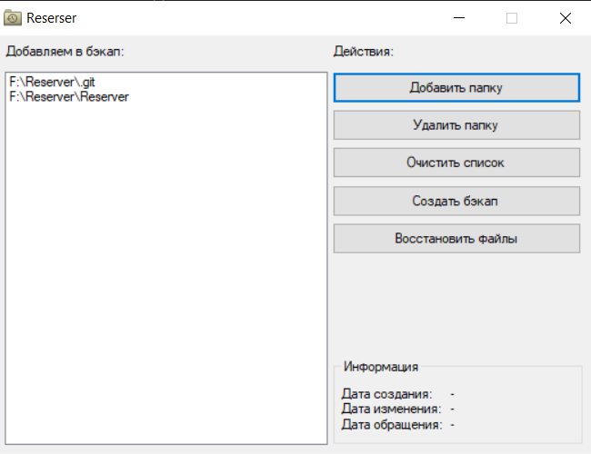

# Reserver
Утилита для операционной системы Windows. Реализована на языке C#. Предназначена для резервного копирования данных на диске.
## Описание и принцип работы
### Создание бэкапа
Утилита предназначена для резервного копирования данных в выбранных директориях. Пользователь выбирает папки на диске, бэкап
которых он собирается сделать. Затем программа создаёт архив каждой из папок под рандомными именами, а также файл backup.dat, содержащий
информацию, какому пути на диске соответствует тот или иной архив. Затем создаётся главный архив, имя которого указывает пользователь,
который содержит в себе архивы папок и файл backup.dat. Главный архив имеет расширение back. Создание архива может занять некоторое время.
Когда программа завершает создание бэкапа, заголовок окна меняется на "execute".
### Восстановление данных из бэкапа
Пользователь выбирает созданный ранее файл бэкапа, после чего программа распаковывает главный архив, читает файл backup.dat и на основании
его сосдержания распаковывает внутренние архивы по пути на диске, который указан в dat-файле. Если какой-то файл или директория, которые есть
в бэкапе, уже существует на диске, то файл на диске удаляется и заменяется файлом из резервной копии. Восстановление файлов может занять некоторое
время. Когда успешно завершается восстановление файлов, заголовок программы содержит "all execute".

## Интерфейс

---
Программа имеет интуитивно понятный интерфейс. В левой части программы находится список, в котором содержатся пути папок на диске, которые будут архивированы.
Справа от списка есть 5 кнопок:
<li> Кнопка "Добавить папку" вызывает диалог выбора папки, а затем добавляет путь папки в список;
<li> Кнопка "Удалить папку" удаляет выбранный пункт в списке;
<li> Кнопка "Очистить список" удаляет все пункты в списке;
<li> Кнопка "Создать бэкап" создаёт резервную копию папок, указанных в списке;
<li> Кнопка "Восстановить файлы" извлекает из выбранного бэкапа файлы и папки. </li>
Ниже кнопок есть рамка "Информация", где отображается дата создания, дата последнего изменения и дата последнего доступа к выбранному бэкапу.

## Использование
Скачать утилиту можно по [этой ссылке](https://github.com/Alexey-Pirogov-02/Reserver/releases/download/1.0.0.0/Reserver.exe). Утилита установки не требует.
